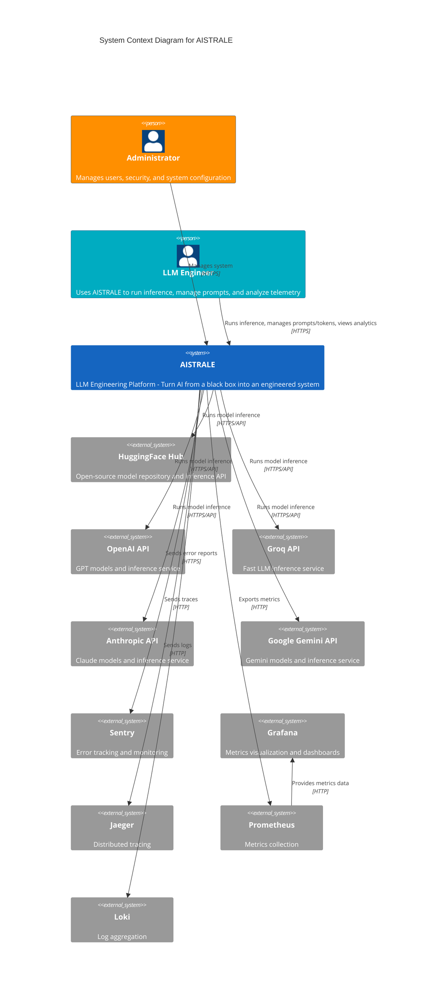

# C4 Model - Context Diagram

## AISTRALE System Context

This diagram shows AISTRALE in the context of its users and external systems.

## Description

**AISTRALE** is an LLM engineering platform that provides:
- Multi-provider LLM inference (HuggingFace, OpenAI, Groq, Anthropic, Gemini)
- Prompt template management
- Token/credential management with encryption
- Telemetry and cost analytics
- Security audit logging
- Comprehensive observability (metrics, logs, traces)

**Users:**
- **Administrators**: Manage users, security settings, encryption keys, and view audit logs
- **LLM Engineers**: Run inference, manage prompts and tokens, view analytics

**External Systems:**
- **LLM Providers**: Various AI model providers for inference
- **Observability Stack**: Prometheus, Grafana, Jaeger, Loki, Sentry for monitoring and debugging

