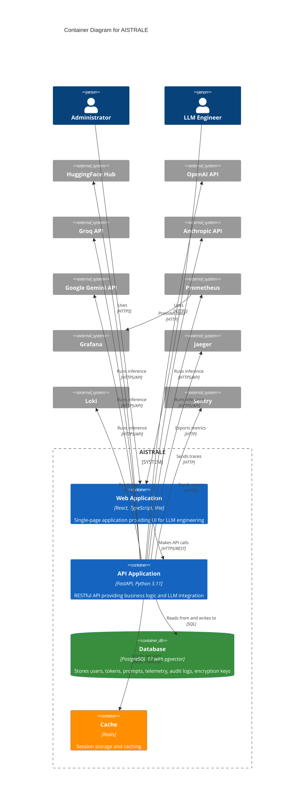

# C4 Model - Container Diagram

## AISTRALE Container Architecture

This diagram shows the high-level technical building blocks (containers) that make up AISTRALE.

## Container Descriptions

### Web Application (Frontend)
- **Technology**: React 18, TypeScript 5, Vite, Tailwind CSS
- **Purpose**: Provides the user interface for all AISTRALE features
- **Responsibilities**:
  - User authentication UI
  - Inference chat interface
  - Prompt template management
  - Token management
  - Telemetry and analytics visualization
  - Admin controls (for administrators)

### API Application (Backend)
- **Technology**: FastAPI, Python 3.11, SQLModel, Pydantic
- **Purpose**: Core business logic and LLM provider integration
- **Responsibilities**:
  - Session-based authentication
  - LLM inference orchestration
  - Token encryption/decryption
  - Telemetry tracking
  - Cost calculation
  - Security audit logging
  - Encryption key rotation
  - Observability (metrics, logs, traces)

### Database
- **Technology**: PostgreSQL 17 with pgvector extension
- **Purpose**: Persistent data storage
- **Stores**:
  - Users and authentication data
  - Encrypted API tokens
  - Prompt templates
  - Telemetry records
  - Security audit logs
  - Encryption keys

### Cache
- **Technology**: Redis
- **Purpose**: Session storage and caching
- **Stores**:
  - User sessions (HTTP-only cookies)
  - Temporary data

## Technology Decisions

- **FastAPI**: High-performance async Python framework
- **PostgreSQL with pgvector**: Future-proof for vector embeddings
- **Redis**: Fast session storage for scalability
- **React + TypeScript**: Type-safe, modern frontend
- **Session-based auth**: More secure than JWT for web apps

