# C4 Model - Component Diagram

## AISTRALE API Application Components

This diagram shows how the API application is broken down into components.

```mermaid
C4Component
    title Component Diagram for AISTRALE API Application

    Container(api, "API Application", "FastAPI, Python 3.11", "RESTful API")
    
    Component_Ext(hf_client, "HuggingFace Client", "huggingface_hub", "HuggingFace inference client")
    Component_Ext(openai_client, "OpenAI Client", "openai", "OpenAI inference client")
    Component_Ext(groq_client, "Groq Client", "groq", "Groq inference client")
    Component_Ext(anthropic_client, "Anthropic Client", "anthropic", "Anthropic inference client")
    Component_Ext(gemini_client, "Gemini Client", "google-generativeai", "Gemini inference client")
    
    ComponentDb(database, "Database", "PostgreSQL", "Data persistence")
    Component(cache, "Redis Cache", "Redis", "Session storage")
    
    Component(auth_api, "Auth API", "FastAPI Router", "Handles login, logout, current user")
    Component(users_api, "Users API", "FastAPI Router", "User management (admin only)")
    Component(tokens_api, "Tokens API", "FastAPI Router", "Token CRUD operations")
    Component(inference_api, "Inference API", "FastAPI Router", "LLM inference endpoints")
    Component(prompts_api, "Prompts API", "FastAPI Router", "Prompt template management")
    Component(telemetry_api, "Telemetry API", "FastAPI Router", "Telemetry and cost analytics")
    Component(security_audit_api, "Security Audit API", "FastAPI Router", "Security event logs (admin only)")
    Component(admin_api, "Admin API", "FastAPI Router", "Admin controls (key rotation)")
    
    Component(auth_service, "Auth Service", "Python", "Authentication logic, password hashing")
    Component(inference_service, "Inference Service", "Python", "Orchestrates LLM inference")
    Component(pricing_service, "Pricing Service", "Python", "Calculates inference costs")
    Component(key_rotation_service, "Key Rotation Service", "Python", "Manages encryption key rotation")
    Component(security_audit_service, "Security Audit Service", "Python", "Logs security events")
    Component(provider_factory, "Provider Factory", "Python", "Creates LLM provider instances")
    
    Component(hf_provider, "HuggingFace Provider", "Python", "HuggingFace-specific inference logic")
    Component(openai_provider, "OpenAI Provider", "Python", "OpenAI-specific inference logic")
    Component(groq_provider, "Groq Provider", "Python", "Groq-specific inference logic")
    Component(anthropic_provider, "Anthropic Provider", "Python", "Anthropic-specific inference logic")
    Component(gemini_provider, "Gemini Provider", "Python", "Gemini-specific inference logic")
    
    Component(session_middleware, "Session Middleware", "starsessions", "Session management")
    Component(observability, "Observability", "structlog, prometheus, opentelemetry", "Logging, metrics, tracing")
    Component(scheduler, "Scheduler", "APScheduler", "Background jobs (key rotation)")
    
    Rel(auth_api, auth_service, "Uses")
    Rel(users_api, auth_service, "Uses")
    Rel(tokens_api, auth_service, "Uses")
    Rel(inference_api, inference_service, "Uses")
    Rel(prompts_api, auth_service, "Uses")
    Rel(telemetry_api, pricing_service, "Uses")
    Rel(security_audit_api, security_audit_service, "Uses")
    Rel(admin_api, key_rotation_service, "Uses")
    
    Rel(inference_service, provider_factory, "Uses")
    Rel(provider_factory, hf_provider, "Creates")
    Rel(provider_factory, openai_provider, "Creates")
    Rel(provider_factory, groq_provider, "Creates")
    Rel(provider_factory, anthropic_provider, "Creates")
    Rel(provider_factory, gemini_provider, "Creates")
    
    Rel(hf_provider, hf_client, "Uses")
    Rel(openai_provider, openai_client, "Uses")
    Rel(groq_provider, groq_client, "Uses")
    Rel(anthropic_provider, anthropic_client, "Uses")
    Rel(gemini_provider, gemini_client, "Uses")
    
    Rel(inference_service, pricing_service, "Uses")
    Rel(inference_service, security_audit_service, "Uses")
    
    Rel(auth_service, database, "Reads/writes users")
    Rel(tokens_api, database, "Reads/writes tokens")
    Rel(prompts_api, database, "Reads/writes prompts")
    Rel(inference_service, database, "Writes telemetry")
    Rel(security_audit_service, database, "Writes audit logs")
    Rel(key_rotation_service, database, "Reads/writes encryption keys")
    
    Rel(session_middleware, cache, "Stores sessions")
    Rel(auth_api, session_middleware, "Uses")
    
    Rel(api, observability, "Uses for logging/metrics/tracing")
    Rel(api, scheduler, "Runs background jobs")
    
    UpdateElementStyle(auth_api, $bgColor="#1565C0", $fontColor="#FFFFFF")
    UpdateElementStyle(inference_api, $bgColor="#1565C0", $fontColor="#FFFFFF")
    UpdateElementStyle(inference_service, $bgColor="#00ACC1")
    UpdateElementStyle(provider_factory, $bgColor="#FF8F00")
```

## Component Descriptions

### API Routers
- **Auth API**: Login, logout, current user info
- **Users API**: User management (admin only)
- **Tokens API**: CRUD operations for API tokens
- **Inference API**: Run LLM inference, view history
- **Prompts API**: Prompt template management
- **Telemetry API**: View telemetry logs and cost analytics
- **Security Audit API**: View security event logs (admin only)
- **Admin API**: Administrative controls like key rotation

### Services
- **Auth Service**: Password hashing, session management
- **Inference Service**: Orchestrates LLM inference across providers
- **Pricing Service**: Calculates costs based on tokens and model pricing
- **Key Rotation Service**: Manages encryption key lifecycle
- **Security Audit Service**: Logs security-related events

### LLM Providers
- **Provider Factory**: Creates provider instances based on type
- **Provider Implementations**: HuggingFace, OpenAI, Groq, Anthropic, Gemini
  - Each implements the same interface for consistency
  - Handles provider-specific API calls and response formatting

### Infrastructure Components
- **Session Middleware**: Manages HTTP-only cookie sessions
- **Observability**: Structured logging, Prometheus metrics, OpenTelemetry tracing
- **Scheduler**: Runs background jobs (quarterly key rotation)

## Design Patterns

- **Factory Pattern**: Provider factory creates LLM provider instances
- **Strategy Pattern**: Different providers implement the same interface
- **Repository Pattern**: Database access through SQLModel
- **Middleware Pattern**: Session and observability middleware
- **Service Layer**: Business logic separated from API routes

